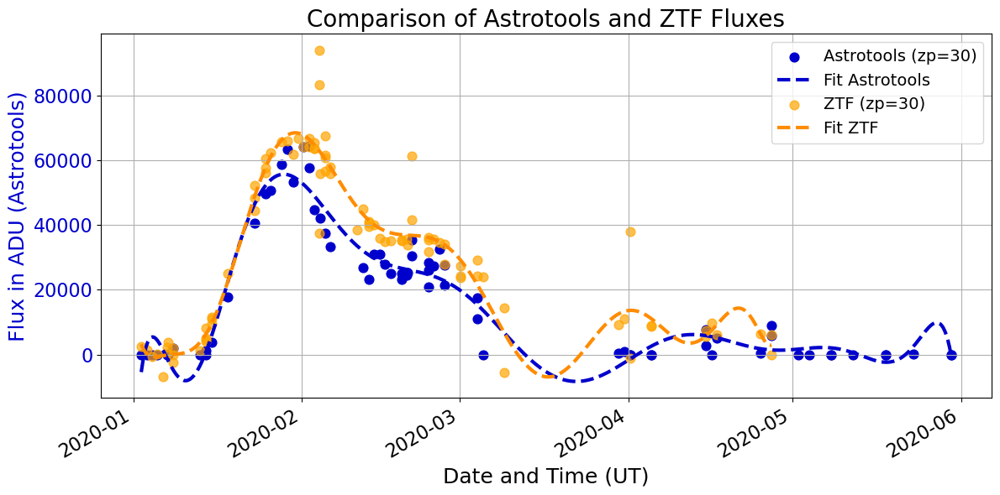
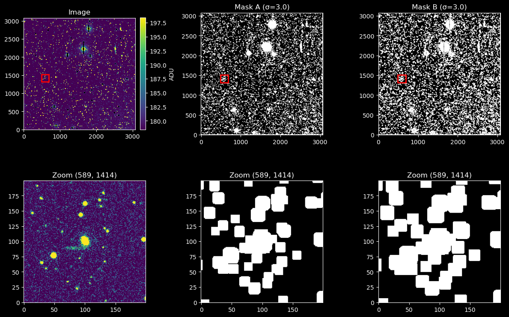
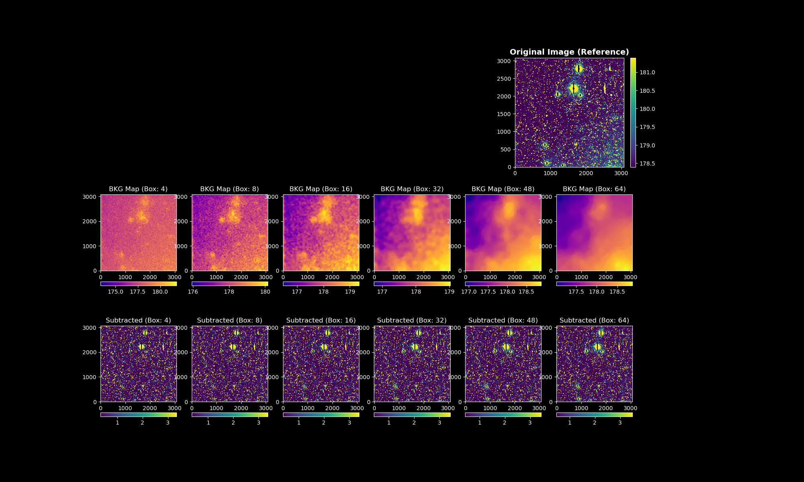
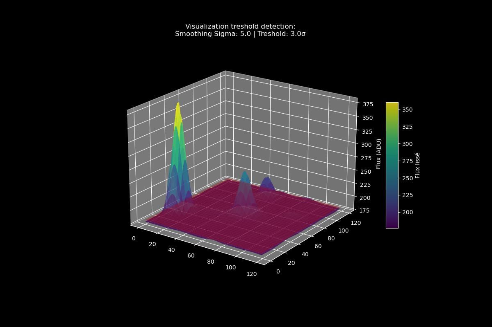
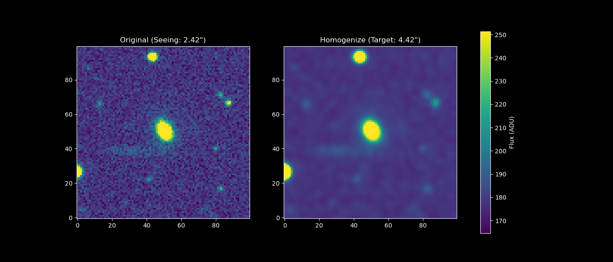

# ZTF Difference Imaging Pipeline 🌌

## 📌 Project Overview
This repository contains a Python-based pipeline designed to process public science images from the **Zwicky Transient Facility (ZTF)**. The core objective is to perform precise image subtraction to isolate transients and extract light curves.

This project is the continuation of my **Master’s Thesis in Fundamental Physics and Applications (2025)**. Originally built "from scratch" in an independent environment, I am currently refining the pipeline to improve its robustness and scientific accuracy.

## 🎯 Scientific Target: ZTF17aadlxmv
The pipeline is validated using data from **ZTF17aadlxmv**, a **Type Ia Supernova**. These "standard candles" require precise photometry, which I aim to achieve through rigorous image subtraction and background modeling.

## 🛠 Key Features & Implementation
- **Custom Masking Logic**: Advanced detection of saturated pixels and halos using binary dilation (via `scipy.ndimage`) to prevent artifacts during subtraction.
- **Dynamic Background Modeling**: Uses `Background2D` with adjustable mesh grids to account for local sky variations.
- **PSF Homogenization**: Implementation of Gaussian kernel matching to align the PSF of the reference and science frames.
- **WCS Reprojection**: Sub-pixel registration using the `reproject` library for perfect frame alignment.

## 📊 Pipeline Visuals & Diagnostics
Below are the results and diagnostic tests generated during development:

### Light-Curve Results
*Final photometric output for the Type Ia Supernova ZTF17aadlxmv.(AstroTools, the old name of the pipeline, vs. ZTF data)*

### Processing Diagnostics
| Masking & Detection | Background Analysis |
|:---:|:---:|
|  |  |
| *Testing saturation masks and star detection.* | *Impact of box size on background estimation.* |

| Sigma Clipping & Smoothing | PSF Homogenization |
|:---:|:---:|
|  |  |
| *Optimizing sigma values for noise reduction.* | *Impact of Gaussian smoothing on subtraction residuals.* |

## 📂 Repository Structure
- `ZTF_Pipeline.py`: Core library (classes: `SingleFrame`, `ZTFFolderPipeline`, `LightCurveExtractor`).
- `Notebook_ZTF_Pipeline.ipynb`: Interactive demonstration of the pipeline steps.
- `sciimg_FITS_Request.ipynb`: Data acquisition tool (Public ZTF/IRSA API).

## 🚀 Installation
1. Clone the repo: `git clone https://github.com/Quarvois/ztf-image-processing-pipeline.git`
2. Install dependencies: `pip install -r requirements.txt`

---
*Developed for research and personal enrichment in Computational Astrophysics.*
